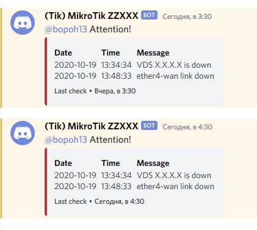

[License]: //creativecommons.org/licenses/by-nc-sa/4.0/deed.ru

# Содержание репозитория

- ***check-logs-60m.rsc*** - скрипт для отправки оповещений из Log в Discord (fetch не всегда срабатывает)  
  
- ***refresh-external-IP.rsc*** - скрипт сохраняет внешний IP в глобальную переменную `publicIP` (`/ip cloud`)
- ***send-mail-7d.rsc*** - скрипт отправляет на email уведомление о новых пакетах RouterOS (если они есть)
- ***ReadMe.md*** - описание и рекомендации по работе с браузером

# WinBox menu

[` `] Quick Set  
[`w`] CAPsMAN  
[` `] Interfaces [` `- system]  
[`w`] Wireless [`w`- wireless]  
[` `] Bridge  
[`p`] PPP (PPTP, SSTP, L2TP, OVPN, PPPoE) [`p`- ppp]  
[` `] Switch  
[` `] Mesh  
[` `] IP  
~	[` `] ARP  
~	[` `] Accounting  
~	[` `] Addresses  
~	[` `] Cloud  
~	[`d`] DHCP Client [`d`- dhcp]  
~	[`d`] DHCP Relay  
~	[`d`] DHCP Server  
~	[` `] DNS  
~	[` `] Firewall  
~	[`h`] Hotspot [`h`- hotspot]  
~	[`s`] IPsec [`s`- security]  
~	[` `] Kid Kontrol  
~	[` `] Neighbors  
~	[` `] Packing  
~	[` `] Pool  
~	[` `] Routes  
~	[` `] SMB  
~	[` `] SNMP  
~	[` `] Services  
~	[` `] Settings  
~	[` `] Socks  
~	[` `] TFTP  
~	[` `] Traffic Flow  
~	[` `] UPnP  
~	[` `] Web Proxy  
[`m`] MPLS [`m`- mpls]  
~	[`m`] MPLS  
~	[`m`] Traffic Eng  
~	[`m`] VPLS  
[`i`] IPv6 [`i`- ipv6]  
~	[`i`] Addresses  
~	[`d`] DHCP Client [`d`- dhcp]  
~	[`d`] DHCP Relay  
~	[`d`] DHCP Server  
~	[`i`] Firewall  
~	[`i`] ND  
~	[`i`] Neighbors  
~	[`i`] Pool  
~	[`i`] Routes  
~	[`i`] Settings  
[`r`] Routing [`r`- routing]  
~	[`r`] BFD  
~	[`r`] BGP  
~	[`r`] Filters  
~	[`r`] MME  
~	[`r`] OSPF  
~	[`i`] OSPFv3  
~	[`r`] Prefix List  
~	[`r`] RIP  
~	[`i`] RIPng  
[` `] System  
~	[` `] Auto Upgrade  
~	[` `] Certficates  
~	[` `] Clock  
~	[` `] Console  
~	[` `] Disks  
~	[` `] History  
~	[` `] Identity  
~	[` `] LEDs  
~	[` `] License  
~	[` `] Logging  
~	[` `] Note  
~	[` `] Packeges  
~	[` `] Password  
~	[` `] Ports  
~	[` `] Reboot  
~	[` `] Reset Configuration  
~	[` `] Resources  
~	[` `] Routerboard  
~	[` `] SNTP Client  
~	[` `] Scheduler  
~	[` `] Scripts  
~	[` `] Shutdown  
~	[` `] Special Login  
~	[` `] Users  
~	[` `] Watchdog  
[` `] Queues  
[` `] Files  
[` `] Log  
[` `] RADIUS  
[` `] Tools  
~	[` `] BTest Server  
~	[` `] Bandwidth Test  
~	[` `] Email  
~	[`a`] Flood Ping [`a`- advenced-tools]  
~	[` `] Graphing  
~	[`a`] IP Scan  
~	[` `] MAC Server  
~	[`a`] Netwatch  
~	[` `] Packet Sniffer  
~	[` `] Ping  
~	[`a`] Ping Speed  
~	[` `] Profile  
~	[` `] RoMON  
~	[`a`] SMS  
~	[` `] Telnet  
~	[` `] Torch  
~	[` `] Traceroute  
~	[` `] Traffic Generator  
~	[` `] Traffic Monitor  
~	[`a`] WoL  
[` `] New Terminal  
[` `] Dot 1X  
[` `] MetaROUTER  
[` `] Partition  
[` `] Make Supout.rif  
[` `] Manual ([Online](//wiki.mikrotik.com/wiki/Manual:TOC))  
[` `] New WinBox  
[` `] Exit  

#
